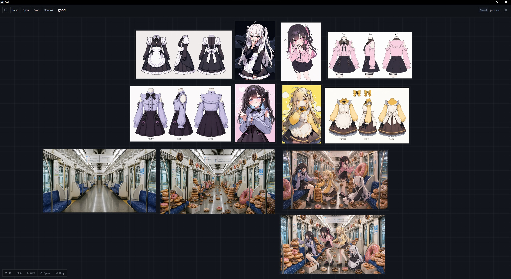

<div align="center">
  
  <h1>Aref</h1>
  <p><strong>무료 데스크톱 레퍼런스 보드. 필요할 때만 AI 생성 기능을 연결합니다.</strong></p>
  <p>
    <a href="./README.md">English</a> ·
    <a href="./README.ja.md">日本語</a>
  </p>
</div>

## 소개

Aref는 이미지를 모으고, 배치하고, 비교하기 위한 로컬 우선 무한 캔버스 앱입니다.

AI를 쓰지 않으면 그냥 무료 레퍼런싱 앱입니다. 이미지를 가져와 보드에 깔고, `.aref` 파일로 저장하고, 오프라인에서도 계속 쓸 수 있습니다. Codex나 이미지 provider를 함께 쓰면 생성 워크플로에 맞게 확장, 수정, 자동화하기 쉽습니다.

## 미리보기

<video src="docs/media/aref-generation-demo.mp4" controls muted playsinline width="100%"></video>

프롬프트와 레퍼런스로 이미지를 생성하고, 결과물을 바로 캔버스 위에서 이동하고 정리할 수 있습니다.



아이디어, 스터디, 생성 결과, 원본 자료를 한 보드에 밀도 있게 펼쳐두는 방식으로 활용할 수 있습니다.

## 기능

- pan, zoom, fit, frame, center를 지원하는 무한 캔버스.
- 파일 선택, 드래그 앤 드롭, 클립보드 붙여넣기로 이미지 가져오기.
- 이동, 리사이즈, 회전, 복제, 그룹, 숨김, 잠금, 순서 변경.
- assets를 포함한 단일 `.aref` 프로젝트 저장/열기.
- 선택적으로 Mock, OpenAI API, ChatGPT OAuth bridge 생성 provider 사용.
- job 기록에서 rerun, prompt reuse, 제거, 로그 확인, 결과물 배치.

## 실행

필요한 것: Node.js 22+, npm 10+, Rust toolchain.

```bash
npm install
npm run dev
```

렌더러만 실행:

```bash
npm run dev:web
```

## AI Provider

AI 설정은 선택입니다. 설정하지 않아도 일반 레퍼런스 보드로 동작합니다.

- Mock: 설정 불필요.
- OpenAI API: Settings에서 설정하거나 `OPENAI_API_KEY` 사용.
- ChatGPT OAuth bridge: 앱의 OAuth 로그인 버튼 사용. Aref는 전역 `~/.codex`에 의존하지 않고 앱 전용 Codex OAuth 홈을 씁니다.

수동 OAuth fallback:

```powershell
npx --yes @openai/codex@latest login
npx --yes openai-oauth@1.0.2 --port 10531 --codex-version 0.124.0
```

## 프로젝트 형식

`.aref`는 `project.json`과 `assets/*`를 포함하는 단일 파일 archive입니다. 현재 저장 포맷은 `schemaVersion: 2`입니다.

## 개발

```bash
npm run typecheck
npm run test
npm run build:desktop
```

릴리스 태그는 `.github/workflows/release.yml`에서 빌드됩니다.
